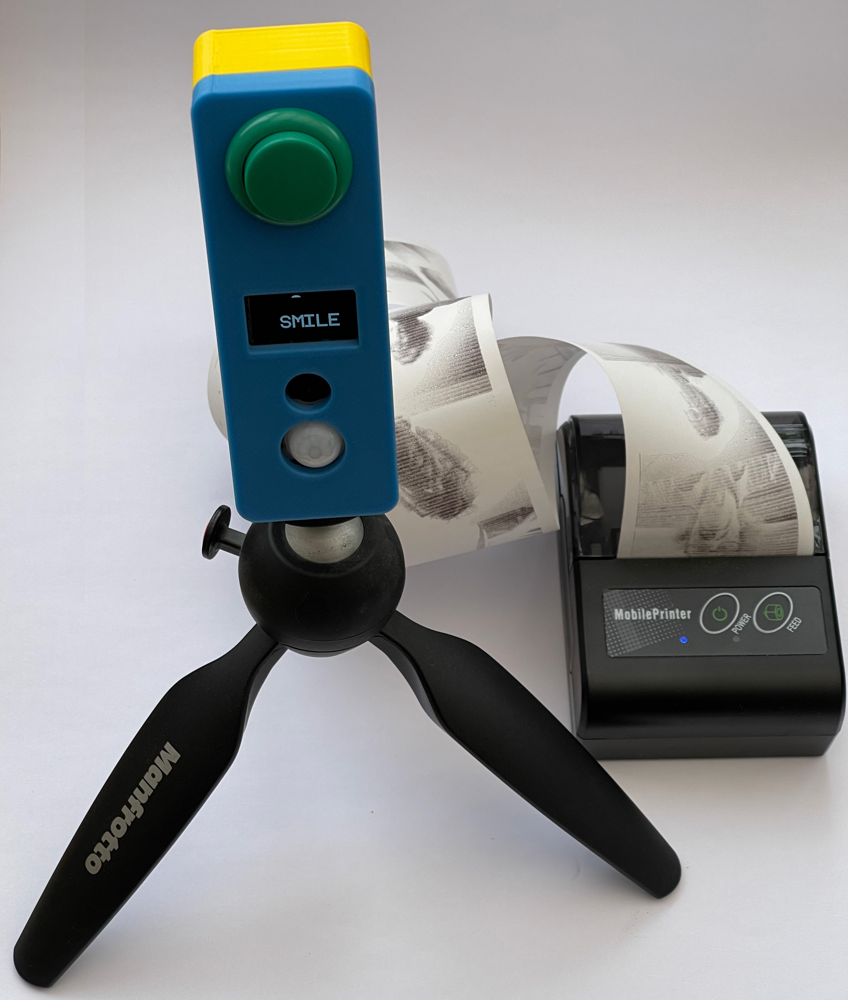
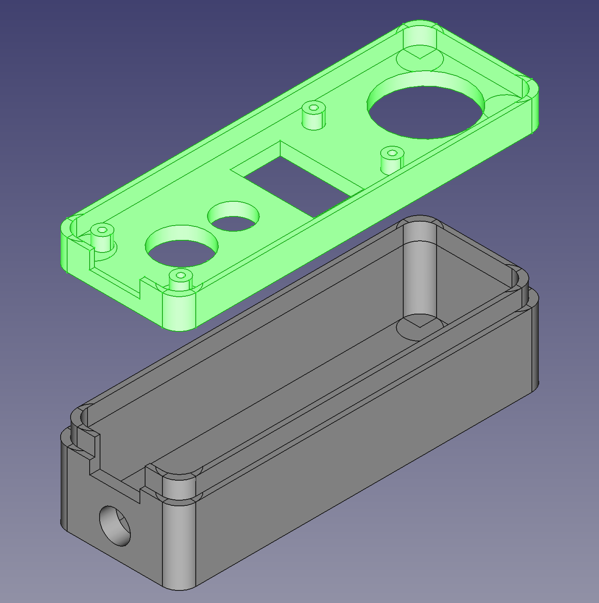

# Printing Party Camera

Designs and software for an ESP32 powered device that will take pictures and print them on a Bluetooth printer.
## Instuctions
The camera wakes up when the PIR sensor is triggered. It initialises the on board camera and searches for a compatible Bluetooth printer. If it finds one it displays a message and waits for the button to be pressed. When the button is pressed the camera shows a five second countdown and then takes and prints a picture. 

If the camera PIR sensor is not triggered for 30 seconds the camera will shut down and until the PIR sensor is triggered again. 

If the camera can't start running (perhaps the printer is not switched on) it will retry five times and then shut down if the PIR sensor is not triggered. 
## Parts list
* Bluetooth thermal printer. Search for “Mini Portable Bluetooth Thermal Printer”. They are usually supplied with a small roll of 57mm wide thermal paper. You can get more from any office supply shop.
* ESP-32 camera board. The “TTGO esp32 camera” unit is perfect for this project. It contains a display and a PIR sensor to wake up the camera. Search for it by name. 
Battery. The TTGO device can connect to a rechargeable battery. Search for “1000mAh 802540 3.7 volt” if you want one that works with the case design.
* A button to activate the camera. Search for “24mm arcade button”.  The author used wire wrap wire to connect the button to the TTGO. You can also get a connector that you can use rather than wire wrap. Search for “TTGO camera cable”.
* A box. There is a 3D printable design available. If you want to put the camera on a tripod you will need a 3/8" to 1/4" camera adapter which you can search for by name. 
* Screws. You'll need some screws side M2 4mm in length to fix the TTGO device to the case (search for "laptop screws").
* Micro USB cable. You program and power the camera via the micro-usb cable on the TTGO cable. 
## Hardware
The button is connected between the GND and IO22 connections on the TTGO board expansion connector. You can do this by connecting to the pins inside the connector, by soldering onto the connector at the back or by using the TTGO expansion cable which is also available.
## Software
The [software](/software) folder holds a complete PlatformIO project for building the camera code. [PlatformIO](https://platformio.org/) runs inside [Visual Studio Code](https://code.visualstudio.com/).
## Case

The [case](/case) folder holds printable designs for the top and bottom of a case along with the Python macro that runs inside [FreeCAD](https://www.freecadweb.org/).
## Acknowledgements
The code for the camera uses the [Thermal Printer](https://github.com/bitbank2/Thermal_Printer) and [JPEGDEC](https://github.com/bitbank2/JPEGDEC) libraries from Larry Bank which is are excellent free resources. Thanks very much. 

Thanks also go to Robot Zero One for their [fridge guard](https://robotzero.one/ttgo-security-camera-pir/) project which provided very useful tips for starting the camera using the PIR sensor. 

Have fun
Rob Miles